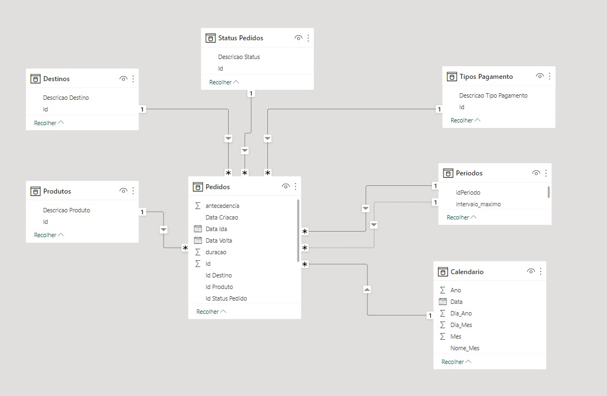
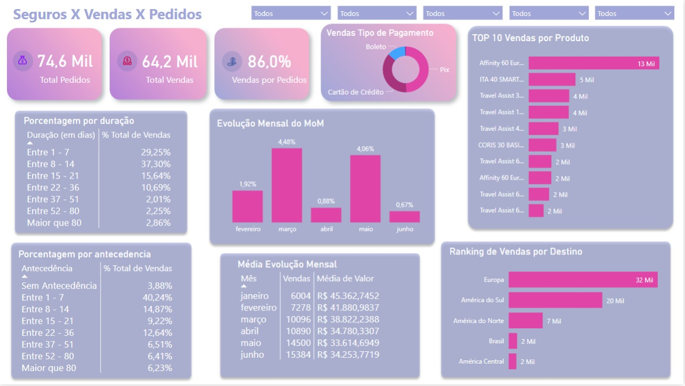

# Amo Promo
### Concorrente: Lais Merotto

# Resumo
> O desafio consiste na criação de um dashboard com 10 (dez) indicadores e 5 (cinco) filtros. Os dados são do primeiro semestre de uma empresa de seguro de viagens para ser transformados e apresentados em seus indicadores para o diretor de vendas da empresa saber como está o negócio. 

# Modelo Entidade Relacionamento

# Dashboard

# Códigos em DAX

###Total de Pedidos
> Total Pedidos = DISTINCTCOUNT(Pedidos[Id])

### Total de Vendas
> Total Vendas = CALCULATE(DISTINCTCOUNT(Pedidos[Id]),Pedidos[Id Status Pedido] = 1)

### Vendas por Pedidos
> Vendas por Pedidos = DIVIDE([Total Vendas], [Total Pedidos])

### Month over Month
> MoM = DIVIDE([Total Pedidos]-[Mes Anterior],[Mes Anterior],0)   

### Mês Anterior
> Mes Anterior = CALCULATE( [Total Pedidos],PREVIOUSMONTH(Calendario[Data]))  

### Antecedencia
>Table.AddColumn(#"Colunas Renomeadas2", "idAntecedencia", each if [antecedencia] > 80 then 7 else if [antecedencia] >= 52 then 6 else if [antecedencia] >= 37 then 5 else if [antecedencia] >= 22 then 4 else if [antecedencia] >= 15 then 3 else if [antecedencia] >= 8 then 2 else if [antecedencia] >= 1 then 1 else 0),

### Duração
>Table.AddColumn(#"Colunas Renomeadas3", "idDuracao", each if [duracao] > 80 then 7 else if [duracao] >= 52 then 6 else if [duracao] >= 37 then 5 else if [duracao] >= 22 then 4 else if [duracao] >= 15 then 3 else if [duracao] >= 8 then 2 else if [duracao] >= 1 then 1 else 1),

# Conclusão
>A conclusão que conseguimos chegar com esse dashboard é que a estratégia de marketing está funcionando, pois mais de 85% do total de pedidos vira em venda e que se deve investir no produto Affinity 60 Europa Promocional, pois além de ser o mais vendido a Europa é o destino mais procurado. OS clientes que geralmente compram esse produto pagam no PIX com até uma semana de antecedência e a viagem dura até duas semanas.

